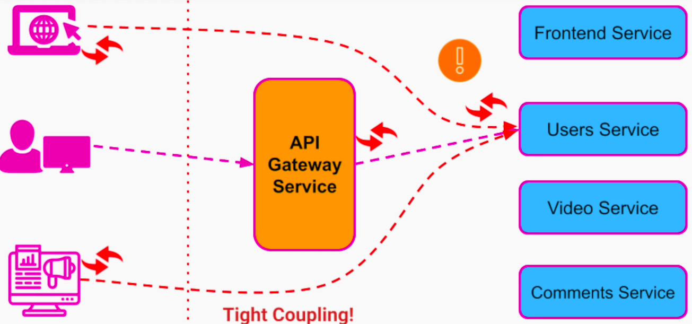

## API Gateway - Motivation
1. Decouple client app from internal organization of our system
2. Reduce code duplication
3. Simply our external API

API Gateway is an API management service that sits in between client and the collection of back-end services. 

API gateway follows a software architecture pattern called API composition. We compose all the APIs of our services into one single API. The client apps can call one single service.

### Benefits
1. Seamless internal modifications / refactoring

2. Consolidating all security, authorization, and authentication in a single place. 
- SSL termination can happen at API gateway
- Depending on the permissions and role of the user, we can allow different operations.
- Implement rate limiting to block DoS attack

3. Request Routing
- we save the overhead of authenticating every request from the user at each service by performing it in a single place
- we can also save user from making multiple requests to the different services

**Without API Gateway**
User will have to make 3 calls to watch a video

**With API Gateway**
API gateway can aggregate results from multiple services and respond back in single API call.

4. Static content and response caching - improves performance

5. Monitoring and Alerting - helps improve our system's observability and availability

6. Protocol Translation

### Considerations and Anti-Patterns
1. API gateway should not contain any business logic 
The main purpose of API gateway is
- API composition
- Routing requests to different services
Adding a business logic to API gateway is an anti-pattern - we will end up making a single service that does all the work and contains an unmanageable amount of code

2. API gateway may become a single point of failure
- put it behind LB
- be extra careful when putting a new release on API gateway

3. Avoid bypassing API gateway from external services

### API Gateway Solutions
#### Open Source API Gateways
##### Netflix Zuul
Zuul is a free and open-source application gateway written in Java that provides capabilities for dynamic routing, monitoring, resiliency, security, and more.

##### Cloud-Based API Gateways
###### Amazon API Gateway
Amazon API Gateway is a fully managed service that makes it easy for developers to create, publish, maintain, monitor, and secure APIs at any scale. Supports RESTful APIs and WebSocket APIs (bi-directional communication between client and server).

###### Google Cloud Platform API Gateway
Google Cloud Platform API Gateway enables you to provide secure access to your services through a well-defined REST API that is consistent across all of your services, regardless of service implementation. It is designed for serverless workloads on GCP. For full documentation, follow this link.

###### Apigee 
Apigee is Google Cloud’s API management product that enables organizations to build, manage, and secure APIs — for any use case, environment (on-premises, in Google Cloud, or a hybrid environment), or scale. For full documentation, follow this link.

###### Microsoft Azure API Management
API Management helps organizations publish APIs to external, partner, and internal developers to unlock the potential of their data and services.

