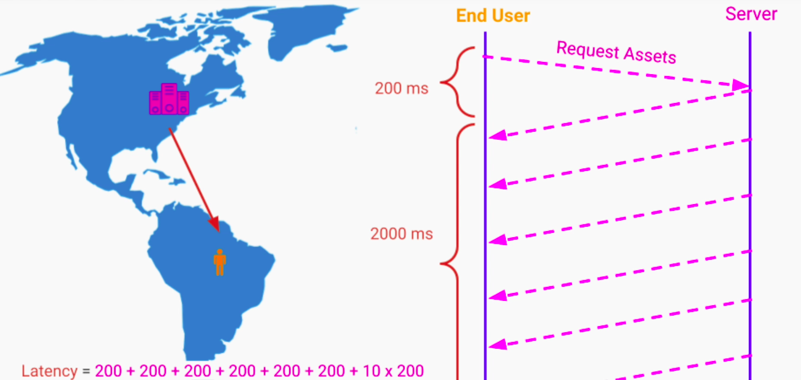
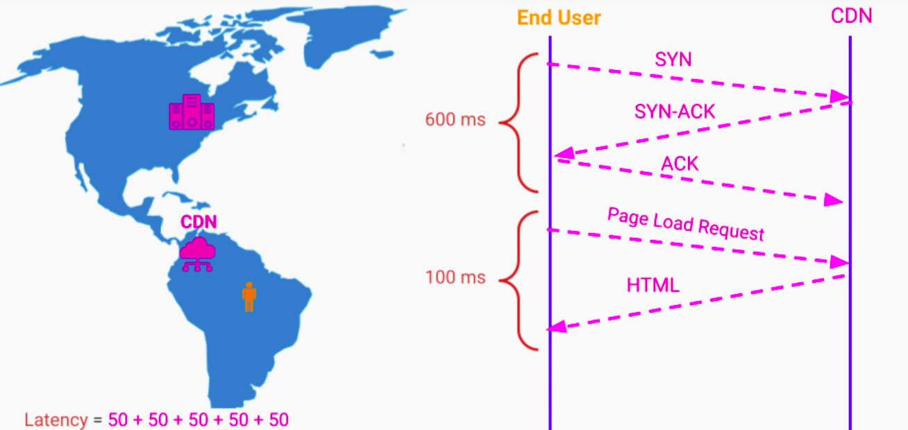
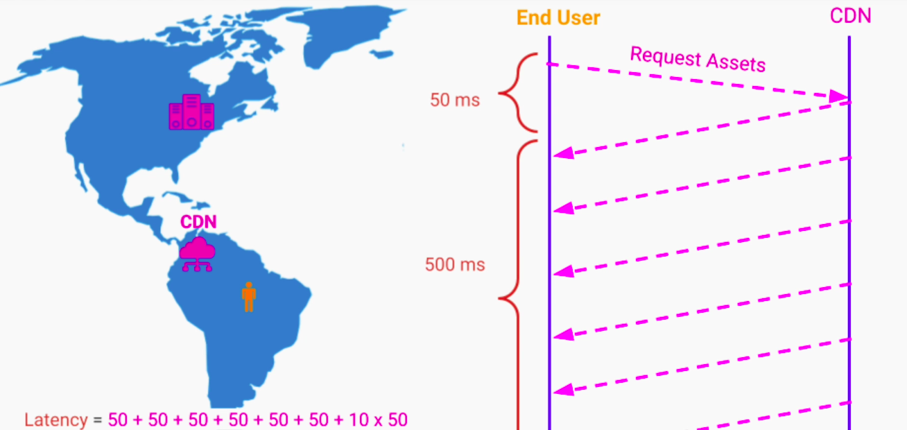

## CDN Motivation
Let's assume that network latency between a user's computer in Brazil and data center in East USA is 200ms.

Since http uses TCP under the hood, because of TCP's three-way handshake just to establish a connection, it would sum up to 600ms. 

Additionally, a network round trip to get an html page will add 400ms.

Assuming that the page has 10 assets, it adds up more latency. This adds up to 3200ms before user sees the webpage.

We need the static content like html, css, JS, images, video files to get closer to user so they load faster.

### About CDN (Content Delivery Network)
1. Globally distributed network of servers, located in strategic places
2. Main purpose is to speed up the delivery of content to end-users
3. CDNs provide service by caching our website content on their edge servers which are relocated at different Points of Presence (PoP)
4. These edge servers are 
- physically closer to  the user
- more strategically located in terms of network infra
5. This allows to;
- transfer content much quicker to user
- improve our perceived system performance

### Quality Attributes
1. Performance - faster page loads
2. HA - issues/slowness are less noticeable
3. Security - Protection against Distributed DoS attacks

**UX with CDN**
Let's assume that there is CDN edge server closer to user in South America that has cached our website static content. The n/w latency between the user's computer and CDN is 50ms.

Total latency now is 800ms. Anything below 3sec for webpage loading time is acceptable UX.

### CDN - Additional Techniques
1. CDN providers use faster and more optimized hard drives to store the cached content
2. Reduce bandwidth by compressing the content delivered using algorithms like;
- Gzip
- Minification of JS files

### Content Publishing Strategies
#### 1. Pull Strategy
1. We need to tell CDN provider;
- which content we want on our website to be cached
- how often this cache needs to be invalidated
It is configured by setting TTL (Time To Live) property on each asset / type of asset

**Advantages**
1. Lower maintenance on our part

**Drawbacks**
1. The first users to use an asset that hasn't been cached yet will have a longer latency
2. Spikes in requests to our system from CDN to refresh the cache if we have the same TTL for our assets
3. If our system is down and CDN cache has expired, user requests will fail

#### 2. Push Strategy
1. We manually or automatically publish content to CDN provider. Whenever the content changes in our system, we are responsible to republish a new version of the content
2. Some CDN providers support this model directly. Others enable this strategy by setting long TTL for our assets so the cache never expires
- whenever we want to publish a new version we purge the content from the cache
- this forces CDN to fetch that content from our servers whenever user requests it

**Advantages**
1. if our content doesn't change frequently we can simply push it once to the CDN
2. This significantly reduces;
- the traffic to our system
- the burden for our system to maintain HA
3. Even if our system goes down temporarily, users will still get all the data from the CDN and won't be affected 

**Drawbacks**
1. If we our content does change frequently, we have to actively publish new versions of the content to the CDN. Otherwise, users will get stale and out of date content

### CDN Solutions
#### Cloudflare
Cloudflare offers ultra-fast static and dynamic content delivery over our global edge network. It helps reduce bandwidth costs and takes advantage of built-in unmetered DDoS protection.

#### Fastly
Fastly's Deliver@Edge is a modern, efficient, and highly configurable CDN that gives you the freedom to control how your content is cached so you can deliver the content your users want quickly.

#### Akamai
Akamai has a large variety of offerings for API Acceleration, Global Traffic Management, Image & Video Management, Media Delivery, and much more.

#### Amazon CloudFront
Amazon CloudFront is a content delivery network (CDN) service built for high performance, security, and developer convenience. Some of its use-cases include delivering fast secure websites, accelerating dynamic content delivery and APIs, live streaming, video-on-demand, and others.

#### Google Cloud Platform CDN
GCP CDN offers fast, reliable web and video content delivery with a global scale and reach.

#### Microsoft Azure Content Delivery Network
Microsoft's CDN solution offers global coverage, full integration with Azure services, and a simple setup.

