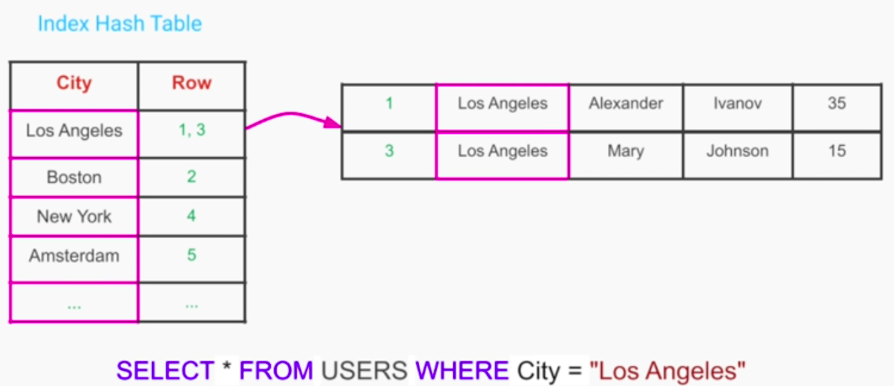
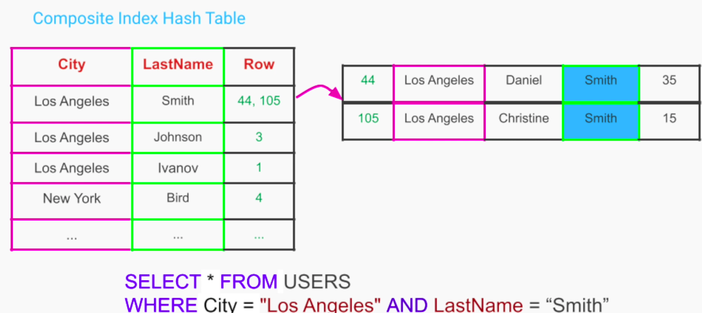

## Techniques to Improve Performance, Availability & Scalability
### Database Indexing - for Performance
1. Speeds up retrieval operations / queries
2. Locate the records in sub-linear time
3. With indexing, those operations may require a "full table scan" and can take a long time for large tables 

**Database Index** is a helper table that we can create from a column or a group of columns.

Once the index table is created, we can put it inside a data structure like HashMap, Self-balanced tree(B-tree) that keeps all the records sorted

**Composite Index**

#### Indexing Trade-offs
1. Read queries are faster at the expense of;
- additional space for storing the index tables
- speed for write operations - whenever we add / update a row, we need update an index table as well

**Indexing is used extensively in Non-Relational DBs to speed up queries**

### Database Replication - for Availability & Fault Tolerance
1. Also helps improve throughput

#### Trade-offs
1. Higher complexity when it comes to write / update and delete ops

#### Notes
1. Distributed database are hard to configure / maintain - need special skills
2. Non-Relational DBs incorporate replication out of the box

### Database Partitioning / Sharding - for Scalability
1. We can scale our database to store more data
2. Different queries can be performed completely in parallel
3. We get;
- better performance
- higher scalability
4. It is a first class feature in almost all Non-Relational DBs

