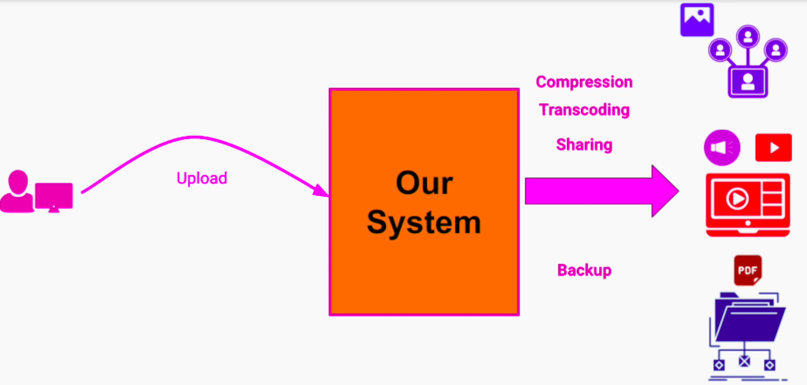
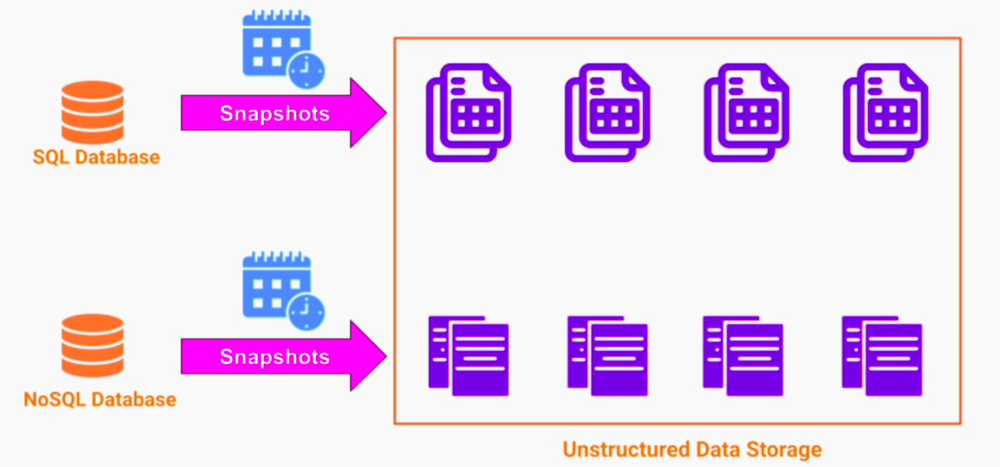
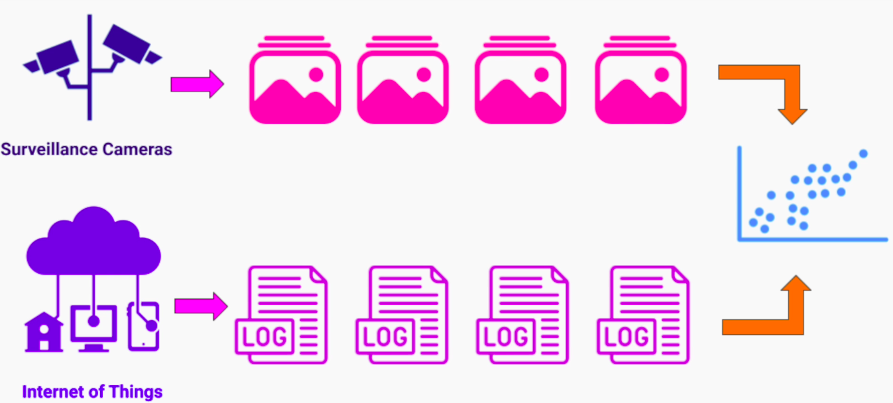
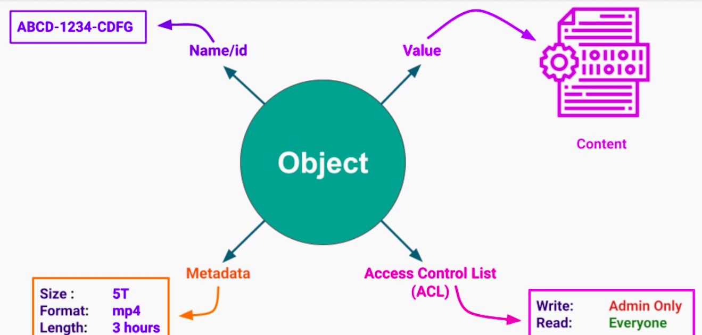
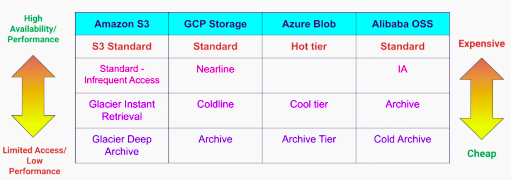

## Unstructured Data
It doesn't follow any particular structure, schema or model.

Examples; binary files like audio, video, images, pdf docs. Without a specific tool that can decode this data, all we have is a Blob - Binary large object.

Some DBs allows storing blobs, but DBs are not optimized for unstructured data. Also, most of the DBs have size limits on storing binary objects (~megabytes)

## Use cases for Unstructured Data
1. Allowing users to upload data like images, videos, audios, pdfs, etc to our system for further processing. 

2. DB backup and archiving for disaster recovery and auditing

3. Web Hosting of images, videos, etc
4. Machine Learning and Big Data Analytics 

### Main Features of the Use Cases
1. Data sets are very big
2. Each file / object is very big

## Solutions to Store Unstructured Data
### Distribute File System
1. No need for a special API
2. We can easily modify files. E.g.; modify a document, append to log / video file
3. Very efficient and high performance IO operations - Big data analysis and transformations on big dataset. Particularly useful for machine learning projects and IOT

**Limitations**
1. Number of files is limited
2. No easy access through web API (HTTP + REST)

### Object Store / Blob Store
1. Scalable storage solution for unstructured data at internet scale
- Linear scalability
2. No limit to the number of objects we can store
3. Very high limit on a single object size (~5-10 Terabytes)
4. Provides an HTTP + REST API - makes it very easy to store web content that we can link to our web-site. E.g.; images, videos, etc
5. Support object versioning out of the box
6. Files are stored in **Buckets**

#### Object Store Abstraction

#### Cloud based Object Stores - Storage Classes

Top-tier is the best option for user facing content like videos, images. 
Middle-tiers are ideal for backups that aren't needed frequently
Lowest tier for a long term archiving - data is rarely used, archived for legal purposes

#### On-Premise Object Stores
##### OpenIO
A software-defined open-source object storage solution ideal for Big Data, HPC, and AI. It is S3 compatible and can be deployed on-premises or cloud-hosted on any hardware that you choose.

##### MinIO
High-performance, S3-compatible object storage. It is native to Kubernetes and 100% open source under GNU AGPL v3.

##### Ceph
Open-source, reliable and scalable storage. Ceph provides a unified storage service with object, block, and file interfaces from a single cluster built from commodity hardware components.

#### Drawbacks
1. Objects are immutable
- we can replace an existing object with a new version
- have negative performance implications - e.g.; storing large document for collaboration, log files appending

2. No easy file system like access
- use SDK or REST API

3. Lower IO performance compared to a Distributed FS

