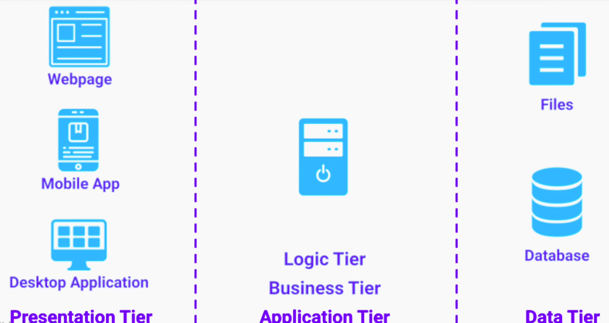

## Architectural Patterns
1. are general repeatable solutions to commonly occurring system design problems.
2. Common solutions to software architectural problems that involve multiple components that run as separate runtime units

### Incentives
1. Save valuable time and resources
2. Avoid making our architecture resemble a Big Ball of Mud

### Notes
1. All the software architectural patterns are just guidelines 
2. As systems evolve, certain architectural patterns may not fit us anymore

## Multi-Tier Architecture
1. **Logical separation** limits the scope of responsibility on each tier
2. **Physical separation** allows each tier to be separately
- developed
- upgraded
- scaled

Multi-tier is different from multi-layer. Multi-layer app has logical separation of layers but it runs as a single unit - making it single tier architecture. In multi-tier, application in each tier runs physically on different infra.

Multi-tier architecture is based on client-server model. Typically, skipping a tier is not encouraged. I.e.; tier 1 calling tier 3 by skipping tier 2.

### Variations
#### Three-Tier Architecture
Most common and popular architectural pattern for client-server, web-based services

## Microservices Architecture
Microservices architecture organizes our business logic as a collection  of loosely coupled and independently deployed services

Each service is  owned by a small team and has a narrow scope of responsibility

### Advantages
1. Smaller Code-base
- easier and faster development
- easy to reason about
- fast to load in IDE
- easy to test and troubleshoot

2. Better performance and scalability
3. Better organizational scalability
4. Better security (fault isolation)

### Considerations and Best Practices
1. We don't get all these benefits out of the box
2. Overhead and challenges
3. Organizational Decoupling

**Best Practices**
1. SRP
2. Separate database per service

## Event Driven Architecture

Event Streaming for Fraud Detection
Event Sourcing for account statement - no need for DB
