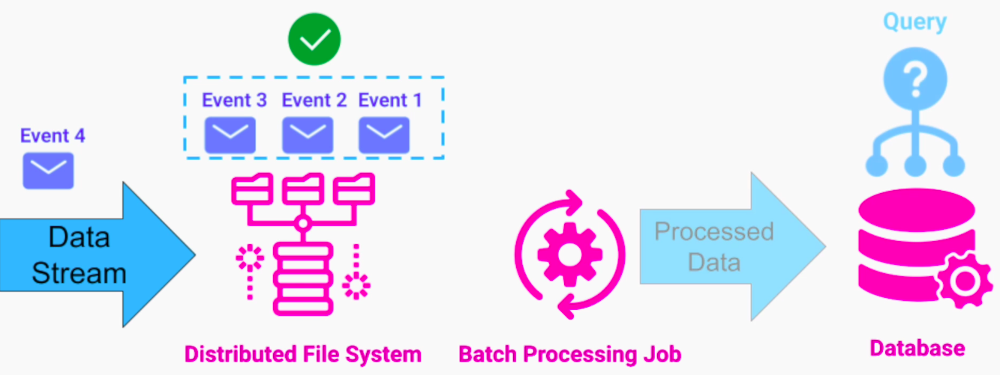

## Big Data
Big Data is a term that is used to describe datasets that are either
1. Too large in size
2. Too complex in structure
3. Comes to our system at a high rate 
that exceeds the capacity of a traditional application to  process it to provide any value.

## Characteristics of Big Data
### Volume
1. Refers to quantity of data that we need to;
- process
- store
- analyze

2. In Big Data, we are talking about large quantities of data, in the order of magnitudes of;
- Terabytes
- Petabytes
per day

3. Systems that use large volume of data
- Internet search companies
- Patient health analysis systems
- Weather forecast systems

### Variety
1. Traditional non-Big Data systems, we work with well-defined types of data. In Big Data, large variety of unstructured data from multiple sources are received
2. Goal is to process all that data - Data Fusion  - combining data together
- helps find hidden patterns and insights 

3. Systems that use variety of data
- Social media collects variety of data about the behavior of their user base in real time. E.g.; user's clicks, likes, posts, amount of time spent watching video, hovering over an article or digital adv. All these seemingly unrelated data can help predict user's behavior when specific type of adv is presented. 

On aggregate level, if we combine all these data for all users, it can help determine trends and clusters of interests. 

### Velocity
1. In Big Data, we have a continuous stream of data that comes to our system at a very high rate
2. The high rate of incoming data can be either due to;
- large scale of our system
- high frequency of events
3. Systems that have high velocity of data coming in
- online store that operates at global level
- IoT  - high frequency of events

## Insights from Analyzing Big Data
1. Can provide a significant advantage over our competitors
2. Come in form of;
- **visualization** - a powerful tool that allows humans to make sense of meaningless data stored in some file system or database
- **querying capabilities**
In many cases, after we collect lot of data we don't know, how we can benefit from it right away. Querying capabilities allow us to run ad-hoc analysis on that data. This helps us find those insights / patterns that were not obvious before
- **predictive analysis**
We can build algorithms or Machine learning models. We can also detect anomalies in the system by analyzing logs from servers to automatically roll-back a release and alert engineers on call.

## Big Data Processing Strategies

### Batch Processing Model
The view that we generate should reflect the knowledge we have about our entire dataset

Depending on a use case, Batch processing can;
- pick up only the data that arrived recently
- process the entire data set from scratch

#### Advantages
1. Easy to implement
2. Provides HA
- Until currently running job is done analyzing the entire dataset and providing a new view, we still have the old view for querying - no downtime for users
3. Better efficiency 
4. Higher Fault Tolerance
- if we push a bad code to our processing job, we still have our original data - higher fault tolerance to human errors
5. Can perform complex and deep analysis of large datasets

#### Drawbacks
1. Long delay between incoming data and result from the processing job
2. By running our batch processing job;
- we don't get a real-time view of the data coming in
- we can't respond to the platform fast enough
3. This forces our users to wait a long time before they can get feedback on actions

### Real Time Processing

#### Advantages
1. We can analyze and respond to data as it comes into our system immediately - we don't have to wait for a job to process it

#### Drawbacks
1. It's hard to do any complex analysis in real-time
- we don't get as much insight into our system
2. Doing data fusion / analyzing historical data is impossible
- we are limited to the recent data that we currently have to provide insights / predictions

## Lambda Architecture
There are use cases that are perfect for;
1. Batch Processing - Delay is not important
2. Real-time processing - Does not need any deep analysis that involves historic data

In many cases, we need the properties of both strategies. Lambda architecture helps address this.

### Layers
Data that comes into our system is dispatched to batch layer and speed layer simultaneously. 

#### Batch Layer
1. Manages data set and be a system of records
2. Pre-compute Batch Views - in most cases, it overrides previous dataset
3. Aims for perfect accuracy and operates on entire dataset

#### Speed Layer
1. Compensates for the high latency in the batch layer
2. Operates only on the most recent data
3. Doesn't attempt to;
- provide a complex view
- make any complex data corrections

#### Serving Layer
1. Support ad-hoc queries and merges both batch and real-time views.

